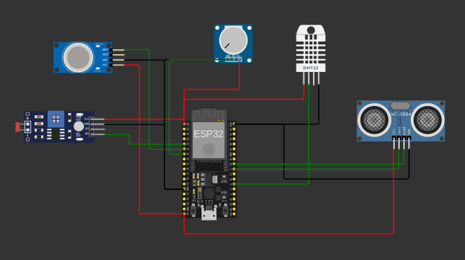

# IIoT Gateway - ESP32

An ESP32-based Industrial IoT gateway simulation built with ESP-IDF and PlatformIO. The master node reads multiple simulated sensors in Wokwi, stores the readings in holding registers, and prints MQTT-style telemetry payloads to the serial monitor.

## Circuit



## Features

- Reads temperature and humidity from a DHT22 sensor.
- Reads ambient light from an LDR/photoresistor sensor.
- Reads potentiometer input as an analog process value.
- Reads gas sensor analog output.
- Measures distance using an HC-SR04 ultrasonic sensor.
- Stores sensor values in `holdingRegisters`.
- Simulates MQTT publishing through serial output.

## Hardware / Simulation Parts

- ESP32 DevKit C
- DHT22 temperature and humidity sensor
- Photoresistor sensor
- Gas sensor
- HC-SR04 ultrasonic distance sensor
- Potentiometer
- Wokwi serial monitor

## Pin Map

| Sensor | Signal | ESP32 Pin |
| --- | --- | --- |
| DHT22 | SDA | GPIO4 |
| Photoresistor | AO | GPIO34 / ADC1_CH6 |
| Potentiometer | SIG | GPIO32 / ADC1_CH4 |
| Gas sensor | AOUT | GPIO35 / ADC1_CH7 |
| HC-SR04 | TRIG | GPIO5 |
| HC-SR04 | ECHO | GPIO18 |

## Project Structure

```text
master-node/
├── assets/                  # Circuit screenshot
├── components/dht/           # DHT sensor component
├── include/main.h            # Shared declarations, pins, and prototypes
├── src/main.c                # Application entry point
├── src/sensor_init.c         # ADC and GPIO initialization
├── src/sensorReadings.c      # Sensor read functions
├── src/sensorHandler.c       # Periodic sensor task and register updates
├── src/simulatedMQTT.c       # MQTT-style serial output
├── diagram.json              # Wokwi circuit definition
├── platformio.ini            # PlatformIO build configuration
└── wokwi.toml                # Wokwi firmware configuration
```

## Build

```bash
pio run -e master
```

If `pio` is not in your shell path, use:

```bash
/home/nazim/.platformio/penv/bin/pio run -e master
```

## Run In Wokwi

1. Build the firmware with PlatformIO.
2. Open the project in Wokwi.
3. Start the simulation.
4. Watch the serial monitor for MQTT-style output.

Example output:

```text
========== MQTT SIMULATION ==========
Topic: factory/temperature
Payload: 253

Topic: factory/humidity
Payload: 605

Topic: factory/light
Payload: 1001

Topic: factory/potentiometer
Payload: 2048

Topic: factory/gas
Payload: 258

Topic: factory/ultrasonic
Payload: 123
=====================================
```

Temperature, humidity, and ultrasonic distance are stored as scaled integer values where one decimal place is multiplied by 10.

## Notes

- The project uses ESP-IDF through PlatformIO.
- Sensor values are simulated in Wokwi using `diagram.json`.
- The MQTT publisher is currently simulated with `printf()` output, not a live broker connection.
